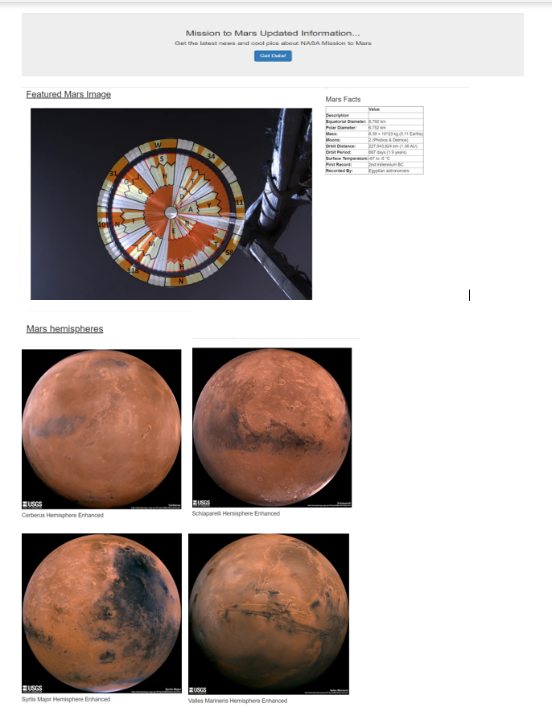

# Web scraping-Mission to Mars

Mission to Mars Web Scraping

The objective of this  project is to create an application that extract information from the Web, save it to a local Mondgos DB and rend the data to a HTML page.

Goals:
- Obtain latest news about the mission from  [NASA Mars News Site](https://mars.nasa.gov/news/
- Obtain the feature image for this mission: [here](https://www.jpl.nasa.gov/spaceimages/?search=&category=Mars).
- Gather some facts about Mission to Mars from (https://space-facts.com/mars/)
- Get high resolution images from Mars Hemisphere located in the webpage: (https://astrogeology.usgs.gov/search/results?q=hemisphere+enhanced&k1=target&v1=Mars)
- Create a Flask application to retrieve the above information and store results in Mongos DB

Technologies used:

- BeautifulSoup
- Requests/Splinter
- MongosDB
- Flask
- JupyterNotebook

Final HTLM:

